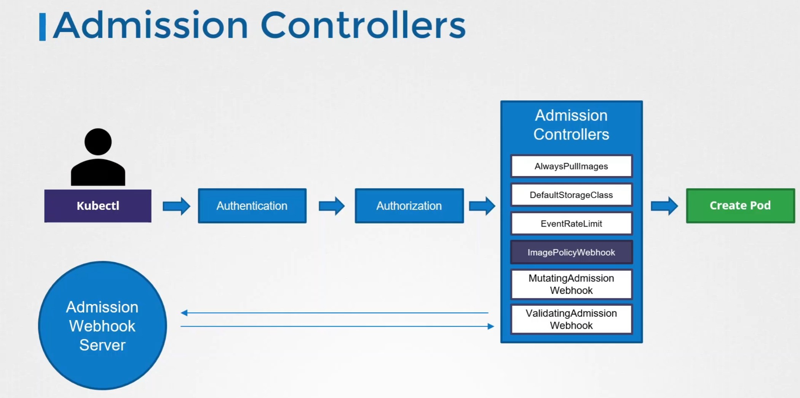

# Cluster setup and hardening

### CIS Benchmark (CIS = Center for Internet Security)
1. Export CIS Benchmark report at `/var/www/html` named `index.html, interactive mode, no timestamp
```
sh ./Assessor-CLI.sh -i -rd /var/www/html/ -nts -rp index
```

2. Install kube-bench from source with config file in same dir

### Authentication
```
# authen by user
curl -v -k https://master-node-ip:6443/api/v1/pods -u "user1:password123"

# authen by token
curl -v -k https://master-node-ip:6443/api/v1/pods --header "Authorization: Bearer <token>"
```

### Service Account
1. create token for service account to access kubernetes dashboard
k create token <service_account>

2. create api token for service account
create sa
create secret point to sa
edit sa to use secret

access api pods through token
curl https://localhost:6443/api/v1/namespaces/<namespace>/pods --header "Authorization: Bearer <token>" --insecure

### Certificates API: khó quá bỏ qua

### RBAC
run as user: k get pods --as user-dev

### Network Policy
```yaml
# sample 1:  
# allow traffic from the Internal application only to the payroll-service and db-service
# allow egress traffic to DNS ports TCP and UDP (port 53) to enable DNS resolution from the internal pod.
apiVersion: networking.k8s.io/v1
kind: NetworkPolicy
metadata:
  name: test-network-policy
  namespace: default
spec:
  podSelector:
    matchLabels:
      role: db
  policyTypes:
  - Egress
  egress:
  - to:
    - podSelector:
        matchLabels:
          role: payroll
    ports:
    - protocol: TCP
      port: 8080
  - to:
    - podSelector:
        matchLabels:
          role: payroll
    ports:
    - protocol: TCP
      port: 3306
  - ports:
    - port: 53
      protocol: UDP
    - port: 53
      protocol: TCP


# sample 2
# allow all connection from (pod with label name=api-pod AND belong to namespace prod) OR (server ip: 102.168.5.10)
apiVersion: networking.k8s.io/v1
kind: NetworkPolicy
metadata:
  name: test-network-policy
  namespace: default
spec:
  podSelector:
    matchLabels:
      role: db
  policyTypes:
  - Ingress
  ingress:
  - from:
    - podSelector:
        matchLabels:
          name: api-pod         # match all pod label name=api-pod, in all namespace
      namespaceSelector:
        matchLabels:
          name: prod            # match all pod in namespace label prod
    - ipBlock:
        cidr: 192.168.5.10/32   # allow traffic from server ip
    ports:
    - protocol: TCP
      port: 3306


# compare to sample 2
# allow all connection from pod with label name=api-pod OR pod in namespace prod OR server ip: 102.168.5.10
apiVersion: networking.k8s.io/v1
kind: NetworkPolicy
metadata:
  name: test-network-policy
  namespace: default
spec:
  podSelector:
    matchLabels:
      role: db
  policyTypes:
  - Ingress
  ingress:
  - from:
    - podSelector:
        matchLabels:
          name: api-pod 
    - namespaceSelector:    # different here, there is "-"
        matchLabels:
          name: prod    
    - ipBlock:
        cidr: 192.168.5.10/32
    ports:
    - protocol: TCP
      port: 3306


# sample 4: Deny egress traffic from namespace-worker to external sites (internet)
# Allow egress traffic from namespace-worker only to internal services in the cluster
apiVersion: networking.k8s.io/v1
kind: NetworkPolicy
metadata:
  name: deny-external-egress
  namespace: namespace-worker
spec:
  podSelector: {}  # Selects all pods in namespace-worker
  policyTypes:
  - Egress
  egress:
  # Allow egress to all pods in all namespaces
  - to:
    - namespaceSelector: {}  # All namespaces
      podSelector: {}        # All pods
```

### Docker daemon
unix socket: /var/run/docker.sock


### Audit
4 audit levels:
- `None`: don't log events that match this rule.
- `Metadata`: log events with metadata (requesting user, timestamp, resource, verb, etc.) but not request or response body.
- `Request`: log events with request metadata and body but not response body. This does not apply for non-resource requests.
- `RequestResponse`: log events with request metadata, request body and response body. This does not apply for non-resource requests


# System Hardening
### Limit Node Access
```yaml
# delele user
deluser USER

# delete group
delgroup GROUP

# delete user from group
deluser USER GROUP

# Suspend user so that this user cannot login to the system but make sure not to delete it
# Make user as system account
usermod -s /usr/sbin/nologin USER

# ssh config
vi /etc/ssh/sshd_config
PermitRootLogin no
PasswordAuthentication no

# add existing user to group
usermod -aG GROUP USER

# copy ssh key to node01 user jim
ssh-copy-id -i ~/.ssh/id_rsa.pub jim@node01
ssh jim@node01 

# run user jim as sudo without password
vi /etc/sudoers
jim  ALL=(ALL) NOPASSWD:ALL
```

### Remove unwanted packages, services
```yaml
# some commands: https://learn.kodekloud.com/user/courses/certified-kubernetes-security-specialist-cks/module/d67be5ee-871d-4435-a187-382610cb6a1f/lesson/4be6aacf-94b3-44da-8b02-e57bbf1e7f41

# List installed packages
apt list --installed

# We want to blacklist the evbug kernel module on controlplane host
vim /etc/modprobe.d/blacklist.conf
```

### UFW
```yaml
#  allow incoming connection on these ports from IP range 135.22.65.0/24 to any interface on node01
ufw allow from 135.22.65.0/24 to any port 9090 proto tcp

# Disable the port 80 on node01 for ALL incoming requests.
ufw deny 80
```


# Supply Chain Security

### Whitelist allowed registries, ImagePolicyWebhook
```yaml
# image webhook policy https://kubernetes.io/docs/reference/access-authn-authz/admission-controllers/
# We need to make sure that when pods are created in this cluster, they cannot use the latest image tag, irrespective of the repository being used.
# To achieve this, a simple Admission Webhook Server has been developed and deployed. A service called image-bouncer-webhook is exposed in the cluster internally. 
# This Webhook server ensures that the developers of the team cannot use the latest image tag. Make use of the following specs to integrate it with the cluster using an ImagePolicyWebhook

kube-apiserver (with admission-config-file param and admisison-plugins=ImagePolicyWebhook) ->AdmissionConfiguration -> kubeconfig -> service webhook backend (contains rules)


```

# Monitoring, Logging and Runtime Security
### Falco
```yaml
# if there are multiple rules file, the same rule at the last file will override these previous
# /etc/falco/falco.yaml
rule_files:
- /etc/falco/falco_rules.yaml
- /etc/falco/falco_rules.local.yaml
- /etc/falco/falco_rules.d

```

### kube-linter (static analysis)
```yaml
kube-linter lint <k8s-yaml-file>
```

### kubesec (static analysis)
```yaml
kubesec scan <k8s-yaml-file>
```

### Audit log


# Minimize Microservices Vulnerabilities
### Admission Controllers
- https://learn.kodekloud.com/user/courses/certified-kubernetes-security-specialist-cks/module/7431dd03-f5c2-4ebb-b94a-2d35615bbd8c/lesson/e25733b7-ff01-41ea-b1b7-6dffbd805590
- Lab: https://learn.kodekloud.com/user/courses/certified-kubernetes-security-specialist-cks/module/7431dd03-f5c2-4ebb-b94a-2d35615bbd8c/lesson/65fb07e4-26e5-47c8-a1c2-115b9d934385

- Admission Controllers helps us implement better security measures to enforce how cluster is used. For example, we can:
  - Permit images from certain registry
  - Do NOT permit run as root user
  - Only permit certain capabilities
  - etc...

- 2 types of admission controllers (the order is: First mutating then validating):
  + Mutating: mutate the request (eg. add default storage class if not exist) before created
  + Validating: validate the request, allow or deny it

### Pod Security Standard

```yaml
# command to config PSS
kubectl label ns <namespace> pod-security.kubernetes.io/<mode>=<security standard>

- 3 <mode>:
  + enforce: reject pod
  + audit  : record in the audit logs
  + warn   : trigger user-facing warning

- 3 <security standard>:
  + privileged: unrestricted policy
  + baseline  : minimally retrictive policy
  + restricted: heavily restricted policy
```

# Manage Secrets
```yaml
3 ways to mount secret

#1 mount each key of secret
spec:
  containers:
  - name: env-print-demo
    image: busybox
    env:
    - name: USER
      valueFrom:
        secretKeyRef:
          name: sec-from-literal
          key: USER

#2 mount all key 
spec:
  containers:
    - name: pod-map-sec
      image: busybox
      envFrom:        
        - secretRef:
            name: sec-from-literal

#3 mount as volume file
spec:
  containers:
  - name: env-print-demo
    image: busybox
    volumeMounts:
    - name: secret-volume
      mountPath: "/app/config"
      readOnly: true
  volumes:
    - name: secret-volume
      secret:
        name: sec-from-dir
```

### Resource Quota
```yaml
# Create a resource quota file
apiVersion: v1
kind: ResourceQuota
metadata:
  name: team-a-resource-quota
spec:
  hard:
    pods: 5
    requests.cpu: 0.5
    requests.memory: 500Mi
    limits.cpu: 1
    limits.memory: 1Gi
```

### Node Isolation
```yaml
# taint node
k taint node node01 team=team-a:NoSchedule

# schedule pod on tainted node
spec:
  containers:
  - image: nginx
    name: a-pod
  tolerations:
  - key: "team"
    operator: "Equal"
    value: "team-a"
    effect: "NoSchedule"

# untaint
k taint node node01 team-
```